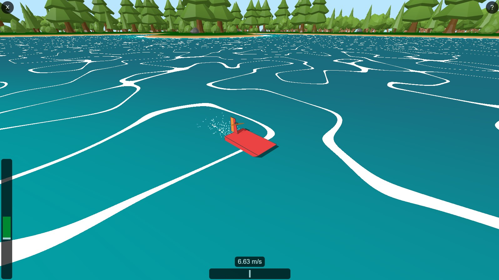

# Three Airboat Sim

A small and simple game where you can ride an airboat on a lake.
It was made as an exercise to learn Three.js and shaders.
The UI is made in Angular and tested using Jasmine.
It also works on mobile using touch controls.

You can access it [here](https://stopnoanime.github.io/three-airboat-sim/).

## Assets used
- [Vegetation Pack - Low Poly](https://skfb.ly/6UYDF)
- [Low-Poly Forest Nature Set](https://www.cgtrader.com/free-3d-models/exterior/landscape/low-poly-forest-nature-set-free-trial)